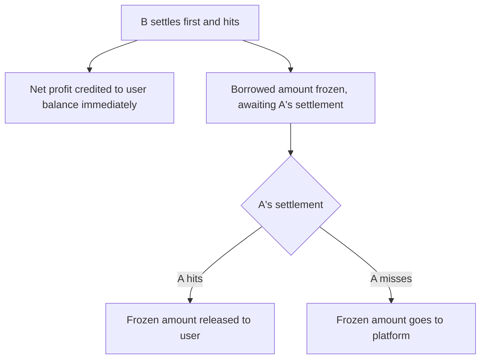

🌐 **English** · [中文](https://oddfi.gitbook.io/oddfi-docs-zh/lending) · [日本語](https://oddfi.gitbook.io/oddfi-docs-ja/lending)

---

# Position Lending

Use a pending bet position as collateral to borrow funds for another bet. Useful when you have active positions but no spare capital.

```
Borrowable amount = Collateral position principal × 50%
```

Example: collateralize a pending 200 ODD bet → borrow up to 100 ODD.

### Restrictions

| Restriction | Rule |
|---|---|
| Position ownership | Must be your own position |
| Position status | Must be Pending (unsettled) |
| Single bets only | Parlay positions cannot be used as collateral |
| No chained borrowing | Positions created via borrowing cannot be re-collateralized |
| Same-match restriction | Borrowed bet and collateral cannot be on the same match |
| Time window | Borrowed bet's match end-time ≤ collateral's match end-time + 7 days |

### Settlement Logic

| Collateral | Borrowed Bet | Outcome |
|---|---|---|
| Hit | Hit | Borrowed bet pays out normally — full claim |
| Hit | Miss | Borrowed bet loses; collateral pays out normally |
| Miss | Hit | **Borrowed bet's profit goes to platform — user cannot claim** |
| Miss | Miss | Borrowed bet cancelled normally — no extra loss |
| Collateral match cancelled | — | Borrowed amount released; borrowed bet settles independently per normal rules |

> Core logic: if the collateral position misses, all profits from the borrowed bet go to the platform — covering the lending risk.

---

### Partial-Freeze Mechanism

When the borrowed bet (B) settles before the collateral (A), and B wins, **net profit is released immediately while the borrowed principal stays frozen until A settles**.



**Example: borrow 120 ODD, B wins paying 264 ODD**

| Step | Amount | Destination |
|---|---|---|
| Released on B settlement | 144 ODD (net profit) | Credited to user balance |
| Frozen, awaiting A | 120 ODD (borrowed amount) | Held until A settles |
| A hits | 120 ODD | Unfrozen, credited to user |
| A misses | 120 ODD | Goes to platform — no bad debt |

> Platform exposure always equals the borrowed amount; releasing net profit early doesn't change settlement logic.

---

### Borrowed Position States

| Status | Meaning |
|---|---|
| Pending | Borrowed bet awaiting settlement |
| Won (Frozen) | B hit, net profit credited, borrowed amount awaiting A |
| Won (Released) | A hit, frozen amount returned to user |
| Won (Forfeited) | A missed, frozen amount went to platform |
| Lost | Borrowed bet missed — no extra loss |
