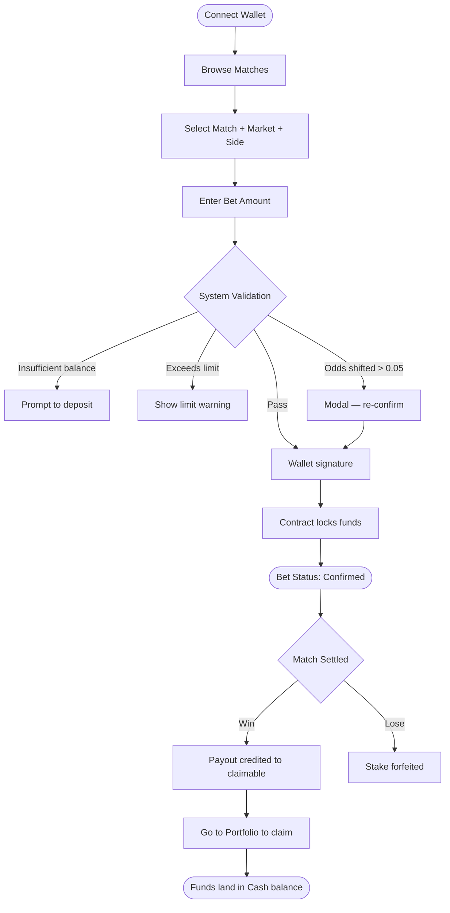

🌐 **English** · [中文](https://oddfi.gitbook.io/oddfi-docs-zh/world-cup) · [日本語](https://oddfi.gitbook.io/oddfi-docs-ja/world-cup)

---

# World Cup Playbook

### Market Types

OddFi currently supports three core football markets:

| Market | Full Name | Description |
|---|---|---|
| 1X2 | Match Result | Predict home win / draw / away win — the most basic market |
| AH | Asian Handicap | Apply a goal handicap to one side, eliminating the draw |
| OU | Over/Under | Predict total goals above or below a given line |

### Match Result (1X2)

Predict the result of regulation time (90 minutes — extra time and penalties not included).

Example: Real Madrid vs. Barcelona

| Selection | Payout Odds | Expected Return on 100 ODD |
|---|---|---|
| 1 (Madrid win) | 2.4 | 240 ODD |
| X (Draw) | 3.2 | 320 ODD |
| 2 (Barça win) | 2.85 | 285 ODD |

> Lower odds = market thinks it's more likely.

### Asian Handicap

Give the favorite a virtual goal disadvantage to narrow or eliminate the draw option.

OddFi offers three handicap lines: -0.5, -1, -1.5.

Example: Manchester City -1.5 vs. Arsenal +1.5

| Final Score | Bet Man City -1.5 | Bet Arsenal +1.5 |
|---|---|---|
| Man City 3:1 (won by 2) | Win | Lose |
| Man City 2:1 (won by 1) | Lose | Win |
| 1:1 Draw | Lose | Win |

> Tip: subtract 1.5 from Man City's actual goals — if they're still ahead, the bet wins.

Quick reference:

| Line | Favorite needs to... | Underdog wins if... |
|---|---|---|
| -0.5 | Win by 1+ | Draw or win |
| -1 | Win by 2+ (1-goal win refunds) | Draw or win (1-goal loss refunds) |
| -1.5 | Win by 2+ | Win, draw, or lose by no more than 1 |

### Total Goals (Over/Under)

Predict whether total goals scored by both teams will be Over or Under a given line.

Half lines (1.5, 2.5, 3.5) — clean win/lose, no push.

Example: line 2.5

| Final Score | Total Goals | Over 2.5 | Under 2.5 |
|---|---|---|---|
| 2:1 | 3 | Win | Lose |
| 1:1 | 2 | Lose | Win |

Quick reference:

| Line | Over wins if... | Under wins if... |
|---|---|---|
| 1.5 | ≥ 2 goals | ≤ 1 goal |
| 2.5 | ≥ 3 goals | ≤ 2 goals |
| 3.5 | ≥ 4 goals | ≤ 3 goals |

---

### Betting Flow

> **Payout Calculation: Potential Payout = Bet Amount × Odds**
>
> Example: bet 100 ODD at odds of 2.78 → potential payout = 278 ODD.

### Settlement

After the match ends, the backend verifies the result against two independent data sources:

- **Both sources agree** → multisig calldata generated → admin wallet confirms → on-chain settlement
- **Sources disagree** → manual review

After settlement: win → payout credited to your claimable balance; lose → stake forfeited.

### Claiming Winnings

1. Go to Portfolio → Claim section
2. Review claimable amount and breakdown
3. Click "Claim" → sign the wallet transaction (you pay gas)
4. Funds land in Cash balance

> A 5% payout tax is deducted at claim time. Example: 100 ODD payout → 5 ODD tax → you receive 95 ODD. Breakdown of the 5pp: 2pp staking pool / 1pp L3 buffer / 1pp platform / 1pp direct referrer.

### Bet Status

| Status | Meaning |
|---|---|
| Confirmed | On-chain confirmed |
| Cancel | Cancelled, funds released |
| Won | Hit, reward not yet claimed |
| Lost | Missed |
| Claim | Reward pending claim |

---

### Parlays (Multi)

Combine multiple match predictions into a single bet ticket — all legs must hit to win.

| Rule | Description |
|---|---|
| Legs | Up to 10 matches |
| Cross-match | Same match can only appear once; can't combine multiple sides of the same market |
| Odds calculation | Multiply all legs' odds (locked at bet time) |
| Max payout | $10,000 (exceeding rejects the ticket) |
| Any leg misses | Entire parlay loses |

> Parlay positions cannot be used as collateral for Position Lending.
>
> Example: 3-leg parlay at 1.80 / 2.10 / 1.95 → combined odds = 7.37 → bet $100, full hit pays $737.

### Early Settlement (Cash Out)

| Item | Description |
|---|---|
| Available when | Active bets only, before match settlement |
| Calculation | Based on current real-time odds |
| Fee | Deducted from cash-out amount |
| Settlement | Instant, funds to Cash balance |

### Bet Limits

| Rule | Description |
|---|---|
| Minimum bet | 10 ODD |
| Single-bet cap | Governed by the signal-light system (see [Odds Mechanism](odds-mechanism.md)); pre-submit check rejects if turning red |
| Daily bet limit | Set by VIP tier (see [Staking](staking.md)) |
| Open exposure rule | ≤ 5,000 ODD: free betting; > 5,000 ODD: cumulative open exposure must not exceed effective stake |
| Odds format | Decimal (European) |
| Insufficient balance | Shows "Insufficient balance" with deposit shortcut |
