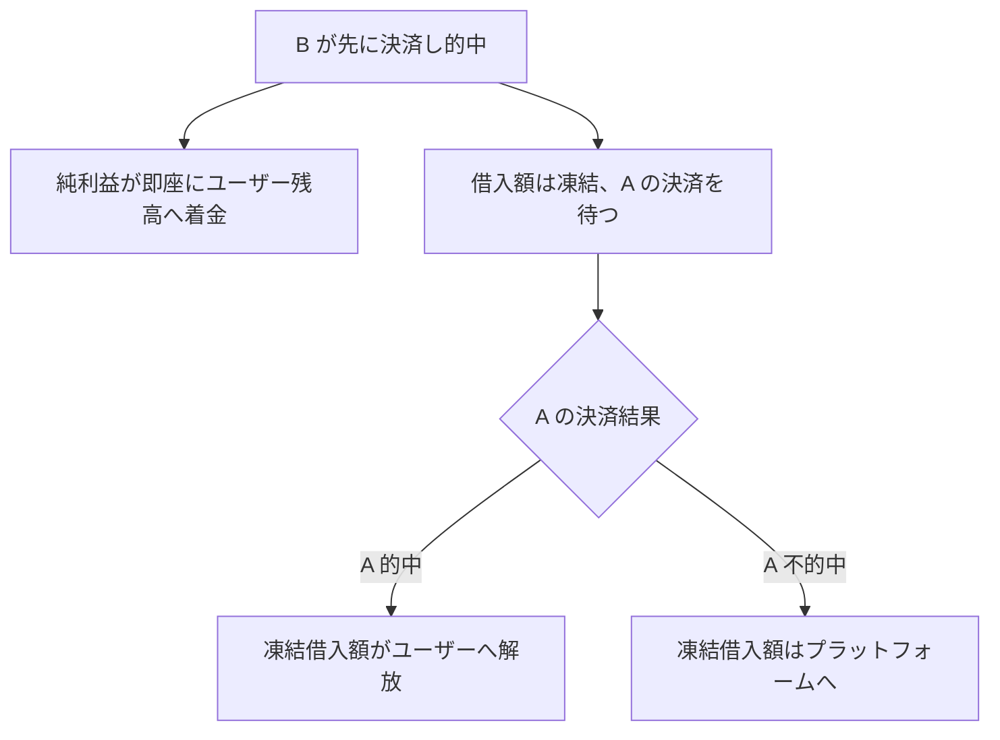

🌐 [English](https://oddfi.gitbook.io/oddfi-docs-en/lending) · [中文](https://oddfi.gitbook.io/oddfi-docs-zh/lending) · **日本語** · [한국어](https://oddfi.gitbook.io/oddfi-docs-ko/lending)

---

# ポジションレンディング

決済待ちのベットポジションを担保として、再ベット用の借入枠を発行します。進行中のポジションがあるが追加資金がないユーザーに最適です。

```
借入可能額 = 担保ポジションの元本 × 50%
```

例：200 ODD の決済待ち注文を担保にすると、最大 100 ODD まで借入可能。

### 利用制限

| 制限項目 | ルール |
|---|---|
| ポジション帰属 | 本人のポジションのみ |
| ポジション状態 | Pending（決済待ち）のみ |
| シングルベットのみ | マルチ予測は担保不可 |
| 連鎖借入禁止 | 借入から生じたポジションは再担保不可 |
| 同一試合制限 | 借入ポジションと担保ポジションは同一試合不可 |
| 時間ウィンドウ | 借入ポジションの試合終了時刻 ≤ 担保ポジションの試合終了時刻 + 7 日 |

### 決済ロジック

| 担保ポジション | 借入ポジション | 結果 |
|---|---|---|
| 的中 | 的中 | 借入ポジションは通常通り報酬を支給、全額受領 |
| 的中 | 不的中 | 借入ポジションは通常通り敗北、担保ポジションは通常通り報酬支給 |
| 不的中 | 的中 | **借入ポジションの利益はプラットフォームに帰属、ユーザーは引き出し不可** |
| 不的中 | 不的中 | 借入ポジションは通常通りキャンセル、追加損失なし |
| 担保試合がキャンセル | — | 借入枠が解放され、借入ポジションは独立して通常ルールで決済 |

> コアロジック：担保ポジションが不的中の場合、借入ポジションのすべての利益はプラットフォームに帰属し、貸付リスクをカバーします。

---

### 部分凍結機構

借入ポジション（B）が担保ポジション（A）より先に決済され、B が勝った場合、**純利益は即座に解放され、借入額は A の決済を待って凍結**されます。



**例：借入 120 ODD、B の配当獲得 264 ODD**

| ステップ | 金額 | 行先 |
|---|---|---|
| B 決済時に即時解放 | 144 ODD（純利益） | ユーザー残高へ着金 |
| 凍結待機 | 120 ODD（借入額） | A の決済待ち |
| A 的中 | 120 ODD | 解凍、ユーザーへ |
| A 不的中 | 120 ODD | プラットフォームへ、貸倒なし |

> プラットフォームのリスクエクスポージャーは常に借入額に等しく、純利益の早期解放は決済ロジックに影響しません。

---

### 借入ポジションのステータス説明

| ステータス | 意味 |
|---|---|
| Pending | 借入ポジション決済待ち |
| Won（凍結中） | B 的中、純利益は着金済、借入額は A の決済待ち |
| Won（解放済） | A 的中、凍結借入額がユーザーに返還済 |
| Won（没収済） | A 不的中、凍結借入額がプラットフォームへ没収 |
| Lost | 借入ポジション不的中、追加損失なし |
