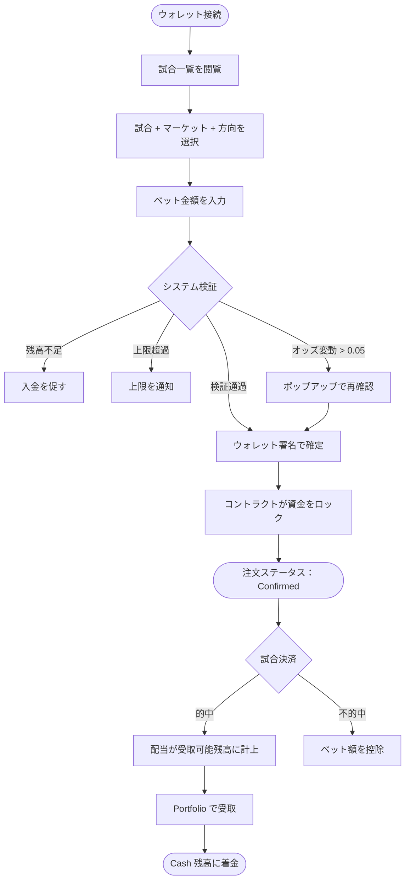

🌐 [English](https://oddfi.gitbook.io/oddfi-docs-en/world-cup) · [中文](https://oddfi.gitbook.io/oddfi-docs-zh/world-cup) · **日本語**

---

# ワールドカップの遊び方

### マーケットの種類

OddFi では現在、サッカーの 3 種類のコアマーケットを提供しています：

| マーケット | 正式名称 | 説明 |
|---|---|---|
| 1X2 | 勝・分・負 | ホーム勝ち / 引き分け / アウェー勝ちを予測する最も基本的な遊び方 |
| AH | アジアンハンディキャップ（Asian Handicap） | 一方のチームに点差を加減して勝敗を判定、引き分けを排除 |
| OU | オーバー / アンダー（Over/Under） | 総得点が指定値より多いか少ないかを予測 |

### 勝敗予測（1X2）

90 分の試合結果を予測します（延長戦・PK 戦は含みません）。

例：レアル・マドリード vs バルセロナ

| 選択肢 | オッズ | 100 ODD ベット時の予想リターン |
|---|---|---|
| 1（マドリード勝利） | 2.4 | 240 ODD |
| X（引き分け） | 3.2 | 320 ODD |
| 2（バルセロナ勝利） | 2.85 | 285 ODD |

> オッズが低いほど、市場がその結果を起こりやすいと見ていることを意味します。

### ハンディキャップ予測（Asian Handicap）

強いチームに仮想的なゴールハンデを与え、引き分けの選択肢を縮小または排除します。

OddFi では 3 種類のハンディキャップを提供：-0.5、-1、-1.5。

例：マンチェスター・シティ -1.5 vs アーセナル +1.5

| 試合結果 | シティ -1.5 を購入 | アーセナル +1.5 を購入 |
|---|---|---|
| シティ 3:1（2 点差勝利） | 勝ち | 負け |
| シティ 2:1（1 点差勝利） | 負け | 勝ち |
| 1:1 引き分け | 負け | 勝ち |

> 理解のコツ：最終スコアからシティに -1.5 を加算し、それでもリードしていれば勝ちです。

ハンディキャップ早見表：

| ハンデ | 強チームに必要な条件 | 弱チームの勝ち条件 |
|---|---|---|
| -0.5 | 1 点差以上の勝利 | 引き分け or 勝ち |
| -1 | 2 点差以上の勝利（1 点差勝ちは返金） | 引き分け or 勝ち（1 点差負けは返金） |
| -1.5 | 2 点差以上の勝利 | 勝ち、引き分け、または 1 点差負けまで |

### 総得点予測（Over/Under）

両チーム合計の得点が指定ライン（Over/オーバー）を上回るか（Under/アンダー）下回るかを予測します。

ハーフボールライン（1.5、2.5、3.5）— 勝ち負けの 2 通りのみ。

例：ライン 2.5

| スコア | 総得点 | オーバー 2.5 | アンダー 2.5 |
|---|---|---|---|
| 2:1 | 3 | 勝ち | 負け |
| 1:1 | 2 | 負け | 勝ち |

総得点早見表：

| ライン | オーバー勝ち条件 | アンダー勝ち条件 |
|---|---|---|
| 1.5 | ≥ 2 点 | ≤ 1 点 |
| 2.5 | ≥ 3 点 | ≤ 2 点 |
| 3.5 | ≥ 4 点 | ≤ 3 点 |

---

### ベッティングフロー

> **配当計算：潜在配当 = ベット金額 × オッズ**
>
> 例：100 ODD ベット、オッズ 2.78 → 潜在配当 = 278 ODD。

### 決済

試合終了後、バックエンドが 2 つの独立データソースから結果を照合します：

- **両ソース一致** → マルチシグ calldata を生成、Admin ウォレットが承認 → オンチェーン決済
- **両ソース不一致** → 手動確認フローへ

決済後：勝ち → 配当が受取可能残高に計上、負け → ベット額が控除されます。

### 報酬の受取

1. Portfolio → 受取エリアへ進む
2. 受取可能金額と明細を確認
3. 「受取」をクリック → ウォレット取引に署名（ガス代はユーザー負担）
4. 資金が Cash 残高へ移動

> 受取金額からプラットフォーム手数料 10% が控除されます。例：受取可能 100 ODD → 手数料 10 ODD → 受領額 90 ODD。

### ベットステータスの説明

| ステータス | 意味 |
|---|---|
| Confirmed | オンチェーンで確定済 |
| Cancel | キャンセル済、資金は解放済 |
| Won | 的中、報酬未受取 |
| Lost | 不的中 |
| Claim | 報酬の受取待ち |

---

### マルチ（連勝）

複数試合の予測を 1 枚の注文に組み合わせ、すべて的中して初めて勝ちとなる遊び方です。

| ルール | 説明 |
|---|---|
| 脚数 | 最大 10 試合 |
| 同一試合 | 1 試合につき 1 種類の予測のみ。同じ試合の複数マーケット・方向を同時に組むことは不可 |
| オッズ計算 | 各脚のオッズを掛け合わせる（予測時点のオッズを固定） |
| 最大配当 | $10,000（超過分は受注不可） |
| いずれかの脚が不的中 | 注文全体が負け |

> マルチポジションはポジションレンディングの担保には使用できません。
>
> 例：3 試合の組み合わせ、各脚オッズ 1.80 / 2.10 / 1.95 → 合成オッズ = 7.37 → $100 ベットで全的中時 $737。

### 早期決済（Cancel）

| 項目 | 説明 |
|---|---|
| 利用条件 | アクティブな予測のみ、試合決済前 |
| 計算方式 | 現在のリアルタイムオッズに基づく |
| 手数料 | 換金額から控除 |
| 決済 | 即時着金、Cash 残高へ移動 |

### ベット上限

| ルール | 説明 |
|---|---|
| 最低ベット | 1 ODD |
| 1 件あたり上限 | オッズ < 2.0：$800 / オッズ 2.0–3.5：$500 / オッズ > 3.5：$300 |
| ユーザー累計未決済上限 | $15,000 |
| オッズ表記 | デシマルオッズ（ヨーロピアン形式） |
| 残高不足 | 「残高不足」を表示し入金導線を提示 |
