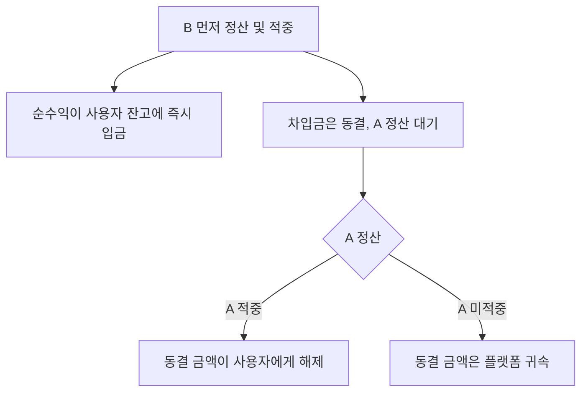

🌐 [English](https://oddfi.gitbook.io/oddfi-docs-en/lending) · [中文](https://oddfi.gitbook.io/oddfi-docs-zh/lending) · [日本語](https://oddfi.gitbook.io/oddfi-docs-ja/lending) · **한국어**

---

# 포지션 렌딩

미정산 베팅 포지션을 담보로 자금을 빌려 다른 베팅에 사용하는 기능입니다. 활성 포지션은 있지만 여유 자금이 없을 때 유용합니다.

```
차입 가능 금액 = 담보 포지션 원금 × 50%
```

예시: 미정산 200 ODD 베팅을 담보로 → 최대 100 ODD 차입 가능.

### 제한 사항

| 제한 | 규칙 |
|---|---|
| 포지션 소유 | 본인 포지션이어야 함 |
| 포지션 상태 | Pending (미정산) 상태여야 함 |
| 단일 베팅만 | 파레이 포지션은 담보 사용 불가 |
| 연쇄 차입 금지 | 차입으로 생성된 포지션은 재담보 불가 |
| 동일 경기 제한 | 차입 베팅과 담보 포지션은 같은 경기일 수 없음 |
| 시간 윈도우 | 차입 베팅 경기 종료 시각 ≤ 담보 경기 종료 시각 + 7일 |

### 정산 로직

| 담보 | 차입 베팅 | 결과 |
|---|---|---|
| 적중 | 적중 | 차입 베팅 정상 페이아웃 — 전액 클레임 |
| 적중 | 미적중 | 차입 베팅 손실; 담보는 정상 페이아웃 |
| 미적중 | 적중 | **차입 베팅 수익은 플랫폼 귀속 — 사용자 클레임 불가** |
| 미적중 | 미적중 | 차입 베팅 정상 취소 — 추가 손실 없음 |
| 담보 경기 취소 | — | 차입금 해제; 차입 베팅은 일반 규칙에 따라 독립 정산 |

> 핵심 로직: 담보 포지션이 미적중하면 차입 베팅의 모든 수익이 플랫폼으로 귀속 — 렌딩 리스크를 보전합니다.

---

### 부분 동결 메커니즘

차입 베팅(B)이 담보(A)보다 먼저 정산되고 B가 적중하는 경우, **순수익은 즉시 해제되고 차입 원금은 A 정산 시까지 동결**됩니다.



**예시: 120 ODD 차입, B 적중하여 264 ODD 페이아웃**

| 단계 | 금액 | 처리 |
|---|---|---|
| B 정산 시 해제 | 144 ODD (순수익) | 사용자 잔고로 입금 |
| 동결, A 대기 | 120 ODD (차입금) | A 정산까지 보관 |
| A 적중 | 120 ODD | 동결 해제, 사용자에게 입금 |
| A 미적중 | 120 ODD | 플랫폼 귀속 — 부실 채권 없음 |

> 플랫폼 익스포저는 항상 차입금과 동일하며, 순수익을 조기 해제해도 정산 로직은 변하지 않습니다.

---

### 차입 포지션 상태

| 상태 | 의미 |
|---|---|
| Pending | 차입 베팅 정산 대기 |
| Won (Frozen) | B 적중, 순수익 입금됨, 차입금 A 대기 |
| Won (Released) | A 적중, 동결 금액이 사용자에게 반환 |
| Won (Forfeited) | A 미적중, 동결 금액이 플랫폼 귀속 |
| Lost | 차입 베팅 미적중 — 추가 손실 없음 |
