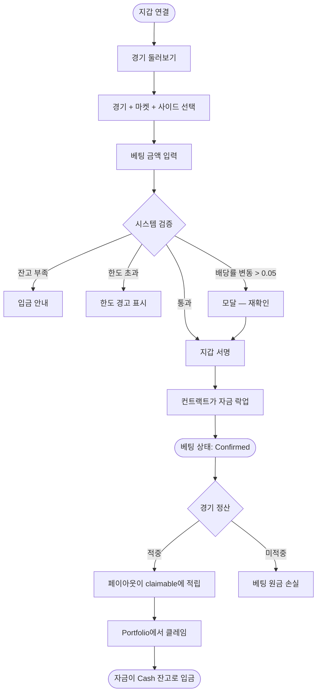

🌐 [English](https://oddfi.gitbook.io/oddfi-docs-en/world-cup) · [中文](https://oddfi.gitbook.io/oddfi-docs-zh/world-cup) · [日本語](https://oddfi.gitbook.io/oddfi-docs-ja/world-cup) · **한국어**

---

# 월드컵 가이드

### 마켓 종류

OddFi는 현재 세 가지 핵심 축구 마켓을 지원합니다:

| 마켓 | 정식 명칭 | 설명 |
|---|---|---|
| 1X2 | 경기 결과 | 홈 승 / 무 / 원정 승 예측 — 가장 기본적인 마켓 |
| AH | 아시안 핸디캡 | 한쪽에 골 핸디캡을 부여하여 무승부 옵션을 제거 |
| OU | 오버/언더 | 양 팀 총 득점이 기준선보다 위인지 아래인지 예측 |

### 경기 결과 (1X2)

정규 시간(90분, 연장전·승부차기 제외) 결과를 예측합니다.

예시: Real Madrid vs. Barcelona

| 선택 | 페이아웃 배당률 | 100 ODD 베팅 시 예상 수익 |
|---|---|---|
| 1 (마드리드 승) | 2.4 | 240 ODD |
| X (무) | 3.2 | 320 ODD |
| 2 (바르사 승) | 2.85 | 285 ODD |

> 배당률이 낮을수록 마켓이 그 결과의 확률이 높다고 본다는 의미입니다.

### 아시안 핸디캡

승리 후보 팀에 가상의 골 핸디캡을 부여하여 무승부 옵션을 좁히거나 제거합니다.

OddFi는 -0.5, -1, -1.5의 세 가지 라인을 제공합니다.

예시: Manchester City -1.5 vs. Arsenal +1.5

| 최종 스코어 | Man City -1.5 베팅 | Arsenal +1.5 베팅 |
|---|---|---|
| Man City 3:1 (2점 차 승) | 적중 | 미적중 |
| Man City 2:1 (1점 차 승) | 미적중 | 적중 |
| 1:1 무승부 | 미적중 | 적중 |

> 팁: Man City의 실제 득점에서 1.5를 뺀 값이 여전히 앞서면 베팅 적중.

빠른 참고:

| 라인 | 강팀이 이기려면... | 약팀이 이기려면... |
|---|---|---|
| -0.5 | 1점 차 이상 승 | 무승부 또는 승 |
| -1 | 2점 차 이상 승 (1점 차 승은 환불) | 무승부 또는 승 (1점 차 패는 환불) |
| -1.5 | 2점 차 이상 승 | 승, 무, 또는 1점 차 패까지 |

### 토탈 골 (오버/언더)

양 팀의 총 득점이 기준선보다 많을지(Over) 적을지(Under) 예측합니다.

반(half) 라인 (1.5, 2.5, 3.5) — 명확한 적중/미적중, 푸시 없음.

예시: 라인 2.5

| 최종 스코어 | 총 득점 | Over 2.5 | Under 2.5 |
|---|---|---|---|
| 2:1 | 3 | 적중 | 미적중 |
| 1:1 | 2 | 미적중 | 적중 |

빠른 참고:

| 라인 | Over 적중 조건 | Under 적중 조건 |
|---|---|---|
| 1.5 | 총 득점 ≥ 2 | 총 득점 ≤ 1 |
| 2.5 | 총 득점 ≥ 3 | 총 득점 ≤ 2 |
| 3.5 | 총 득점 ≥ 4 | 총 득점 ≤ 3 |

---

### 베팅 흐름

> **페이아웃 계산: 잠재 페이아웃 = 베팅 금액 × 배당률**
>
> 예시: 배당률 2.78에 100 ODD 베팅 → 잠재 페이아웃 = 278 ODD.

### 정산

경기 종료 후 백엔드가 두 개의 독립 데이터 소스로 결과를 검증합니다:

- **두 소스가 일치** → 멀티시그 calldata 생성 → 관리자 지갑이 승인 → 온체인 정산
- **두 소스가 불일치** → 수동 심사

정산 후: 적중 → 페이아웃이 claimable 잔고에 적립; 미적중 → 베팅 원금 손실.

### 상금 클레임

1. Portfolio → Claim 섹션 이동
2. 클레임 가능 금액과 내역 확인
3. "Claim" 클릭 → 지갑 트랜잭션 서명 (가스 비용 사용자 부담)
4. 자금이 Cash 잔고로 입금

> 클레임 시점에 5% 페이아웃 세금이 차감됩니다. 예시: 100 ODD 페이아웃 → 5 ODD 세금 → 실수령 95 ODD. 5pp 분배: 2pp 스테이킹 풀 / 1pp L3 버퍼 / 1pp 플랫폼 / 1pp 직접 추천인.

### 베팅 상태

| 상태 | 의미 |
|---|---|
| Confirmed | 온체인 확정 |
| Cancel | 취소되어 자금 해제 |
| Won | 적중, 보상 미클레임 |
| Lost | 미적중 |
| Claim | 보상 클레임 대기 |

---

### 다중 베팅 (Parlay)

여러 경기 예측을 하나의 베팅 티켓으로 결합 — 모든 레그가 적중해야 승리합니다.

| 규칙 | 설명 |
|---|---|
| 레그 수 | 최대 10경기 |
| 동일 경기 제한 | 같은 경기는 한 번만 포함 가능; 동일 마켓의 양쪽을 동시에 선택할 수 없음 |
| 배당률 계산 | 모든 레그의 배당률 곱 (베팅 시점에 락) |
| 최대 페이아웃 | $10,000 (초과 시 티켓 거절) |
| 한 레그 미적중 | 파레이 전체 패배 |

> 파레이 포지션은 포지션 렌딩의 담보로 사용할 수 없습니다.
>
> 예시: 3 레그 파레이, 배당률 1.80 / 2.10 / 1.95 → 합산 배당률 = 7.37 → $100 베팅 시 전체 적중하면 $737 지급.

### 조기 정산 (Cash Out)

| 항목 | 설명 |
|---|---|
| 적용 시점 | 활성 베팅만, 경기 정산 전 |
| 계산 기준 | 현재 실시간 배당률 기반 |
| 수수료 | 캐시아웃 금액에서 차감 |
| 정산 | 즉시, Cash 잔고로 입금 |

### 베팅 한도

| 규칙 | 설명 |
|---|---|
| 최소 베팅 | 10 ODD |
| 단일 베팅 상한 | 신호등 시스템이 결정 ([오즈 메커니즘](odds-mechanism.md) 참고); 제출 전 검증에서 신호등이 빨간색으로 전환되면 거절 |
| 일일 베팅 한도 | VIP 등급에 따름 ([스테이킹](staking.md) 참고) |
| 미정산 익스포저 규칙 | ≤ 5,000 ODD: 자유 베팅; > 5,000 ODD: 누적 미정산 익스포저가 유효 스테이크를 초과하지 않아야 함 |
| 배당률 형식 | 데시멀 (유럽식) |
| 잔고 부족 | "Insufficient balance" 표시와 입금 바로가기 제공 |
