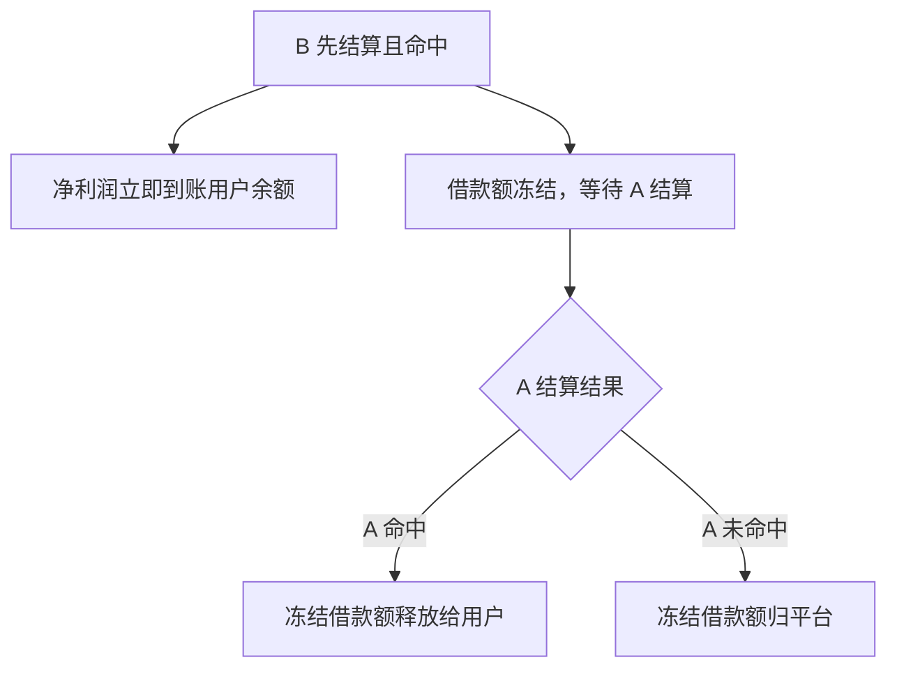

# 仓位借贷

以一个待结算的下注仓位作为抵押，借出额度用于再次下注。适合手中有进行中仓位但暂时没有额外资金的用户。

```
可借额度 = 抵押仓位本金 × 50%
```

示例：抵押一个 200 ODD 的待结算订单，可借出最多 100 ODD。

### 使用限制

| 限制项 | 规则 |
|---|---|
| 仓位归属 | 必须是本人的仓位 |
| 仓位状态 | 必须处于 Pending（待结算） |
| 仅限单注 | 组合预测不可作为抵押 |
| 禁止连环借贷 | 借贷产生的仓位不可再次抵押 |
| 同场限制 | 借贷仓位与抵押仓位不可是同一场比赛 |
| 时间窗口 | 借贷仓位比赛结束时间须 ≤ 抵押仓位比赛结束时间 + 7 天 |

### 结算逻辑

| 抵押仓位 | 借贷仓位 | 结果 |
|---|---|---|
| 命中 | 命中 | 借贷仓位正常发放奖励，全额收取 |
| 命中 | 未命中 | 借贷仓位正常判负，抵押仓位照常发放奖励 |
| 未命中 | 命中 | **借贷仓位赢利归平台，用户无法提取** |
| 未命中 | 未命中 | 借贷仓位正常取消，无额外损失 |
| 抵押仓位赛事取消 | — | 借贷额度释放，借贷仓位独立按普通规则结算 |

> 核心逻辑：抵押仓位若未命中，借贷仓位的一切收益归平台所有，以此覆盖借贷风险。

---

### 部分冻结机制

当借贷仓位（B）先于抵押仓位（A）结算，且 B 赢时，**净利润立即释放，借款额冻结等待 A 结算**。



**示例：借款 120 ODD，B 赢得赔付 264 ODD**

| 步骤 | 金额 | 去向 |
|---|---|---|
| B 结算时立即释放 | 144 ODD（净利润） | 到账用户余额 |
| 冻结等待 | 120 ODD（借款额） | 等待 A 结算 |
| A 命中 | 120 ODD | 解冻，到账用户 |
| A 未命中 | 120 ODD | 归平台，无坏账 |

> 平台风险敞口始终等于借款额，净利润提前释放不影响结算逻辑。

---

### 借贷仓位状态说明

| 状态 | 含义 |
|---|---|
| Pending | 借贷仓位待结算 |
| Won（冻结中） | B 命中，净利润已到账，借款额等待 A 结算 |
| Won（已释放） | A 命中，冻结借款额已归还用户 |
| Won（已没收） | A 未命中，冻结借款额已归平台 |
| Lost | 借贷仓位未命中，无额外损失 |
