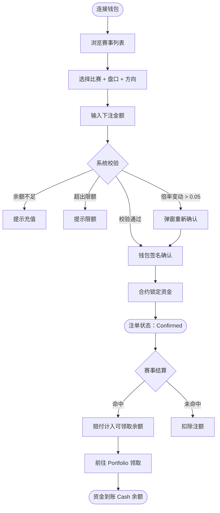

# 世界杯玩法

### 盘口类型

OddFi 目前支持足球的三种核心盘口：

| 盘口 | 全称 | 说明 |
|---|---|---|
| 1X2 | 胜平负 | 预测主胜 / 平局 / 客胜，最基础的玩法 |
| AH | 让球盘（Asian Handicap） | 给一方加减球数后判定胜负，消除平局 |
| OU | 大小球（Over/Under） | 预测总进球数高于或低于指定值 |

### 胜负预测（1X2）

预测 90 分钟常规时间的比赛结果（不含加时赛和点球）。

示例：皇家马德里 vs 巴塞罗那

| 选项 | 回报倍率 | 投入 100 ODD 的预期回报 |
|---|---|---|
| 1（皇马胜） | 2.4 | 240 ODD |
| X（平局） | 3.2 | 320 ODD |
| 2（巴萨胜） | 2.85 | 285 ODD |

> 回报倍率越低 = 市场认为越可能发生。

### 让分预测（Asian Handicap）

给强队一个虚拟球数劣势，缩小或消除平局选项。

OddFi 提供三个让球盘口：-0.5、-1、-1.5。

示例：曼城 -1.5 vs 阿森纳 +1.5

| 比赛结果 | 买曼城 -1.5 | 买阿森纳 +1.5 |
|---|---|---|
| 曼城 3:1（净胜 2 球） | 赢 | 输 |
| 曼城 2:1（净胜 1 球） | 输 | 赢 |
| 1:1 平局 | 输 | 赢 |

> 理解技巧：在最终比分上给曼城 -1.5 球，调整后仍领先就赢。

让分速查表：

| 盘口 | 强队需要... | 弱队赢的条件 |
|---|---|---|
| -0.5 | 赢 1 球以上 | 平或赢 |
| -1 | 赢 2 球以上（赢 1 球退款） | 平或赢（输 1 球退款） |
| -1.5 | 赢 2 球以上 | 赢、平或仅输 1 球 |

### 总分预测（Over/Under）

预测双方总进球数高于（Over/大）还是低于（Under/小）指定盘口线。

半球线（1.5、2.5、3.5）— 只有赢和输。

示例：盘口线 2.5

| 比赛比分 | 总进球 | 大 2.5 | 小 2.5 |
|---|---|---|---|
| 2:1 | 3 | 赢 | 输 |
| 1:1 | 2 | 输 | 赢 |

总分速查表：

| 盘口线 | 大（Over）赢的条件 | 小（Under）赢的条件 |
|---|---|---|
| 1.5 | ≥ 2 球 | ≤ 1 球 |
| 2.5 | ≥ 3 球 | ≤ 2 球 |
| 3.5 | ≥ 4 球 | ≤ 3 球 |

---

### 下注流程

> **赔付计算：潜在赔付 = 下注金额 × 赔率**
>
> 示例：下注 100 ODD，赔率 2.78 → 潜在赔付 = 278 ODD。

### 结算

赛事结束后，后端从两个独立数据源核实比赛结果：

- **两源一致** → 生成多签 calldata，Admin 钱包确认 → 链上结算
- **两源不一致** → 进入人工核查流程

结算后：赢了 → 赔付计入可领取余额；输了 → 扣除下注金额。

### 领取奖励

1. 前往 Portfolio → 领取区域
2. 查看可领取金额和明细
3. 点击「领取」→ 签署钱包交易（你支付 Gas 费）
4. 资金转入 Cash 余额

> 领取金额扣除 10% 平台手续费。示例：可领取 100 ODD → 手续费 10 ODD → 你收到 90 ODD。

### 下注状态说明

| 状态 | 含义 |
|---|---|
| Confirmed | 链上已确认 |
| Cancel | 已取消，资金已释放 |
| Won | 命中，未领取奖励 |
| Lost | 未命中 |
| Claim | 待领取奖励 |

---

### 串关（Multi）

将多场比赛的预测组合成一张注单，所有场次全部命中才算赢。

| 规则项 | 说明 |
|---|---|
| 腿数 | 最多 10 个赛事 |
| 跨赛事 | 同一场比赛只能出现一次，不能同时提交多个玩法的多个方向 |
| 倍率计算 | 各腿倍率连乘（锁定预测时的倍率） |
| 最大回报 | $10,000（超出则拒绝接单） |
| 任意一腿未命中 | 整张组合订单判负 |

> 组合预测仓位不可用于仓位借贷的抵押。
>
> 示例：3 场组合，各腿倍率 1.80 / 2.10 / 1.95 → 组合倍率 = 7.37 → 投入 $100，全部命中可获 $737。

### 提前结算（Cancel）

| 项目 | 说明 |
|---|---|
| 可用条件 | 仅限活跃预测，赛事结算前 |
| 计算方式 | 基于当前实时倍率 |
| 手续费 | 从兑现金额中扣除 |
| 结算 | 即时到账，资金转入 Cash 余额 |

### 下注限额

| 规则 | 说明 |
|---|---|
| 最低下注 | 1 ODD |
| 单笔上限 | 赔率 < 2.0：$800 / 赔率 2.0–3.5：$500 / 赔率 > 3.5：$300 |
| 用户累计未平仓上限 | $15,000 |
| 赔率格式 | 小数赔率（欧洲格式） |
| 余额不足 | 提示「余额不足」并提供充值入口 |
